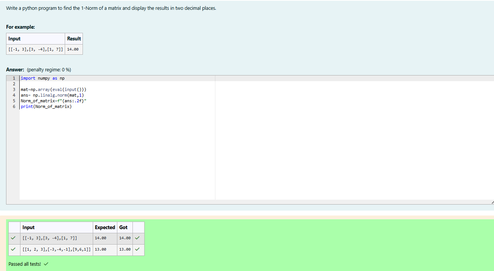

# Norm of a matrix
## Aim
To write a program to find the 1-norm, 2-norm and infinity norm of the matrix and display the result in two decimal places.
## Equipment’s required:
1.	Hardware – PCs
2.	Anaconda – Python 3.7 Installation / Moodle-Code Runner
## Algorithm 1:
	1. Input the matrix as a 2D array.
    2. Calculate the sum of the absolute values for each column.
    3. Identify the maximum of these sums.
    4. Return the result rounded to two decimal places.

## Algorithm 2:
	1. Input the matrix as a 2D array.
    2. Compute the singular values of the matrix.
    3. Find the largest singular value.
    4. Return the result rounded to two decimal places.

## Algorithm 3:
	1. Input the matrix as a 2D array.
    2. Calculate the sum of the absolute values for each row.
    3. Identify the maximum of these sums.
    4. Return the result rounded to two decimal places.
	
## Program:
```Python
# Register No: 24900880
# Developed By: Abishek Priyan M

# 1-Norm of a Matrix

import numpy as np

mat=np.array(eval(input()))
ans= np.linalg.norm(mat,1)
Norm_of_matrix=f"{ans:.2f}"
print(Norm_of_matrix)

# 2-Norm of a Matrix

import numpy as np

mat=np.array(eval(input()))
ans= np.linalg.norm(mat,2)
L2_Norm_of_matrix=f"{ans:.2f}"
print(L2_Norm_of_matrix)

# Infinity Norm of a Matrix

import numpy as np

mat=np.array(eval(input()))
ans= np.linalg.norm(mat,np.inf)
Norm_of_matrix=f"{ans:.2f}"
print(Norm_of_matrix)


```
## Output:
### 1-Norm of a Matrix


### 2-Norm of a Matrix


### Infinity Norm of a Matrix


## Result
Thus the program for 1-norm, 2-norm and Infinity norm of a matrix are written and verified.
